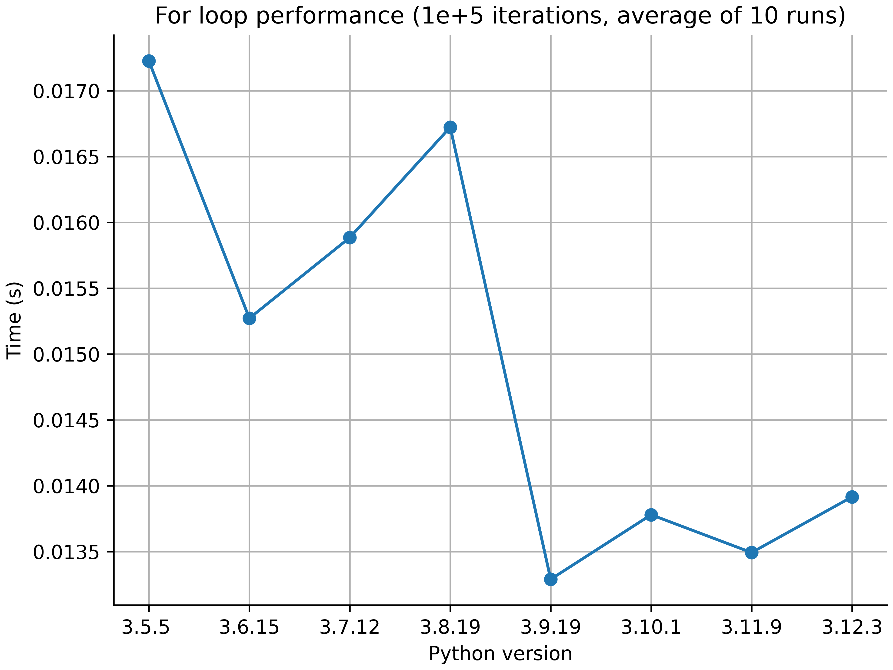

# Python for loop speed test

## Question

How does the speed of loop by `for` depend on Python version?

## Tested code

```python
def test():
    r = 0
    for i in range(int(1e5)):
        r += i
```

## Result


Python is becoming faster...?

## System

1.6 GHz Dual-Core Intel Core i5 (MacBook Air 2019)
